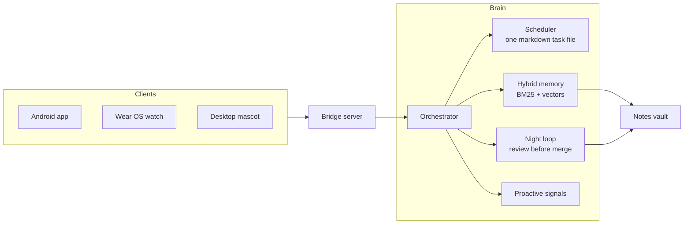
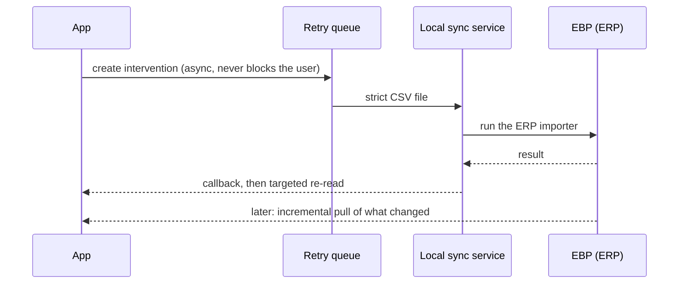
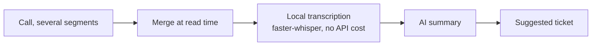
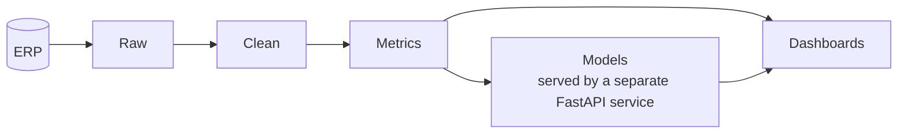
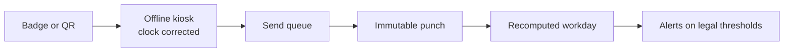

<div align="center">

# Hey, I'm Jordan 👋

**AI engineer and full-stack developer, based in France**

<sub>NestJS · React Native · ML pipelines · autonomous agents</sub>

<p>
  <a href="https://jordan-s.org"></a>
  <a href="mailto:contact@jordan-s.org"></a>
  <a href="https://fr.linkedin.com/in/jordan-serafini-63b9b2177"></a>
</p>

</div>

AI engineer and full-stack dev based in France. Most of my time goes into NestJS backends, React Native apps and, more and more, ML pipelines. I just finished a level 7 programme (French RNCP framework, equivalent to master's level) in AI and machine learning, the Machine Learning Engineer track at Liora (ex DataScientest), with a Mines Paris - PSL Executive Education certificate, on top of a Concepteur Développeur d'Applications title (RNCP 6).

Most of my production work (ERP integrations, internal data platform, mobile apps) lives in private repos for clients or my employer, so the public side here is mostly side projects and school work. Happy to walk through the private architecture in a call.

## AURA: a personal AI orchestrator that works while I don't

<div align="center">

[](https://github.com/JordanSerafini/aura-core)
[](https://github.com/JordanSerafini/aura-android)
[](https://github.com/JordanSerafini/aura-core/tree/main/docs)

</div>

AURA is the project I learn the most from: an orchestrator that runs on my own Linux machine, reaches me on my phone, watch and desktop, keeps my notes current, and does work overnight under a review gate. Most of it is private. Two parts are public, and the rest is documented as honest case studies with measured numbers, failures included.



<table>
  <tr>
    <td width="50%" valign="top">
      <h4>🔔 Proactive, and able to stop</h4>
      It speaks first, then learns from what I ignore or reject.<br/><br/>
      <sub>341 suggestions in 30 days, 17 explicitly rejected.</sub><br/>
      <a href="https://github.com/JordanSerafini/aura-core/blob/main/docs/proactive.md">Read the case study</a>
    </td>
    <td width="50%" valign="top">
      <h4>🌙 Night loop with mandatory review</h4>
      Autonomous sessions overnight. A model-free gate (parse and dry-run merge) decides what lands.<br/><br/>
      <sub>218 missions over 28 nights, 39 % with an effect someone else verified, 0 reverts.</sub><br/>
      <a href="https://github.com/JordanSerafini/aura-core/blob/main/docs/night-loop.md">Read the case study</a>
    </td>
  </tr>
  <tr>
    <td width="50%" valign="top">
      <h4>📓 A vault Claude keeps current</h4>
      Markdown notes with generated sections that scripts and sessions rewrite instead of piling up.<br/><br/>
      <sub>875 notes, 1 finding in 187 checked claims.</sub><br/>
      <a href="https://github.com/JordanSerafini/aura-core/blob/main/docs/vault.md">Read the case study</a>
    </td>
    <td width="50%" valign="top">
      <h4>📱 Phone, watch and desktop mascot</h4>
      Three clients on one server: notifications, phone actions, chat, a mascot that talks first.<br/><br/>
      <sub>About 16.9k lines of Kotlin, 333 unit tests across the phone and watch apps.</sub><br/>
      <a href="https://github.com/JordanSerafini/aura-core/blob/main/docs/mobile-and-mascot.md">Read the case study</a>
    </td>
  </tr>
</table>

### Open source parts

| Repo | What it is | Verified |
|---|---|---|
| [**aura-core**](https://github.com/JordanSerafini/aura-core) | Hybrid memory (SQLite + sqlite-vec + FTS5, RRF fusion), a retrieval benchmark (recall@3, MRR) and a markdown-driven scheduler | 65 tests pass in a fresh venv |
| [**aura-android**](https://github.com/JordanSerafini/aura-android) | Phone app (Expo + a Kotlin native module) and Wear OS app. The backend is not included | 260 Kotlin tests (phone module) and 73 (watch) pass |

<details>
<summary><b>What did not work (and what I am doing about it)</b></summary>

<br/>

- The error-fixing mission is the most frequent one (87 of 218 runs) and has no verified effect.
- The scheduler was down for about 32 hours in September, with no alert. It is now watched by something outside it.
- The review gate checks syntax and merge conflicts, not meaning.
- The overnight loop costs real money. **Next piece of work: cut that cost and make each mission count**, measured as cost per verified effect.

</details>

<sub>All figures: my private instance, measured on 2026-10-05 over the previous 30 days. Sources and caveats are in the case studies.</sub>

## Work: connecting an ERP, a phone system and a ticketing tool

At SLI (a business-software company, permanent contract since September 2026) most of my work is making systems talk that were never designed to. Everything below is private code for my employer, so these are diagrams and **fictional examples**, no real data. They show what each piece does and how it works.

### 1. Two-way sync with a closed ERP

EBP has no public API. The app writes to it by generating strict import files and driving the ERP's own importer, and reads back only what changed.



```text
fictional example
intervention INT-0142 · create    -> file generated -> ERP import ok (3 s)
customer CLI-0087    · update    -> import refused, attempt 2/6, retry in 2 min
```

### 2. Phone system (3CX) to ticket

The call log is mirrored into the app. One call is often several segments (transfer, ring group, voicemail), merged at read time. A voicemail that picks up is a missed call, not an answered one: the stats are wrong until you model that.



```text
fictional example
14:02 · inbound · 4 min 12 · answered by a technician
Summary:    the network printer in office 2 has been offline since this morning
Suggestion: ticket "Printer offline", Technical queue
```

### 3. Ticketing tool connector (NinjaOne)

Create a ticket from a call, log time and notes with the right permissions, find similar past tickets with embeddings, and get a summary adapted to the role (technician, sales, management). One trap worth knowing: a queue is a view on tags, not a field, so a wrong tag creates a ticket that shows up nowhere, with no error. So the connector re-reads after every write.

```text
fictional example
new ticket "Printer offline" -> Technical queue
re-read: ticket is visible in the queue
3 close tickets found (similarity 0.91, 0.87, 0.84)
```

### 4. Analytics and ML on the ERP data



Customer health scores, billing anomaly detection (Isolation Forest), revenue forecasting (Prophet) and a budget overrun model (CatBoost, R² 0.88) with SHAP so the factors are visible.

```text
fictional example
project A · overrun risk 0.72 (high)
factors: heavy discounts, hours over plan, 2 delivery delays
anomaly: duplicate invoice detected on a quote (score 0.94)
```

### 5. Offline time clock for a retail business (in development)

Designed with a client: a kiosk (5G Windows tablet, badge reader, camera for QR codes) that keeps working without internet. A punch is never edited, every correction needs a reason, and workdays are recomputed from punches, never typed in. No photos, no biometrics.



```text
fictional example
06:02 arrival badge (kiosk offline, received at 08:15, clock corrected)
correction: missed departure badge, reason required, workday recomputed: 7 h 45
alert: rest between two workdays under 11 h
```

### 6. Small AI automation agents

A mailbox agent sorts four inboxes, drafts replies and sends a report twice a day. Its guardrails matter more than its features: it sends nothing, deletes nothing, leaves in the inbox anything it is unsure about, and only learns from its owner's corrections, never from a sentence slipped into an incoming email. Same spirit for WhatsApp and SMS campaigns: the design requires provable consent before anything is sent.

```text
fictional example
message 1 · supplier invoice -> filed under "Accounting" (confidence 0.93)
message 2 · confidence 0.41  -> left in the inbox
draft: "Hello, ... [to confirm: delivery date]"
```

## Some things I've built

**[Compagnon Immo](https://github.com/JordanSerafini/Compagnon_Immo_DataScientest)** - price per m² prediction for French real estate. 5.9M listings, 101 départements, 2019-2026. Random Forest tuned with Optuna and enriched with INSEE socio-economic data, R² 0.958 / RMSE 402€ per m², SHAP for explainability and a Streamlit demo. My DataScientest capstone. I also caught and fixed a data leakage on the way (a feature with VIF 346 that was inflating the score), which is half the lesson.

**[MLOps Météo](https://github.com/JordanSerafini/MLOps_Meteo)** - rain prediction on Australian weather data. The model is deliberately simple, the real subject is the MLOps lifecycle: reproducible training, MLflow tracking and registry, a FastAPI serving layer, DVC for data versioning, the whole thing in Docker Compose.

**Internal data platform** *(private, employer)* - a data-driven analytics layer on top of our EBP ERP. Bronze/silver/gold medallion ETL on PostgreSQL, fed from SQL Server, with several ML models in production: budget overrun prediction (CatBoost/XGBoost/LightGBM stacking, R² ~0.88), billing and project anomaly detection (Isolation Forest), revenue forecasting (Prophet). NestJS for the ETL and API, a decoupled FastAPI service for inference, Next.js dashboards on top.

**EBP App** *(private, client)* - a full ERP suite used daily by field technicians: NestJS 11 API (61 modules, 720 endpoints), Next.js back-office, Expo mobile app with offline-first sync on WatermelonDB. The tricky part is a non-destructive bidirectional sync with a closed ERP (EBP, over MSSQL) and a NinjaOne RMM integration. See [the work section above](#work-connecting-an-erp-a-phone-system-and-a-ticketing-tool) for how the integrations work.

**SportPoint** *(private)* - a sports coaching and community app. Microservices on NestJS behind an API gateway (auth, coaching, spots, chat, notifications), PostgreSQL/Prisma, and a React Native / Expo app. Where I practice splitting a monolith mindset into services.

**AURA** *(partly open source)* - my personal AI orchestrator. See [the section above](#aura-a-personal-ai-orchestrator-that-works-while-i-dont), with [aura-core](https://github.com/JordanSerafini/aura-core) and [aura-android](https://github.com/JordanSerafini/aura-android) public.

**[Vélib DPM](https://github.com/JordanSerafini/Velib_DataScientest)** - a data product management case study on the Paris bike-share: personas, KPI framework, 12-month roadmap, MVP design. No ML here, it's the product side of data.

## Stack

TypeScript and Python, mostly.

NestJS, FastAPI, Next.js, React Native / Expo, PostgreSQL, MSSQL, Redis, Docker, plenty of Linux.

ML side: scikit-learn, CatBoost / XGBoost, MLflow, plus the agentic stuff (RAG, sqlite-vec and pgvector, MCP).

## Contact

The fastest way is [jordan-s.org](https://jordan-s.org) or contact@jordan-s.org - CV available in [French](https://jordan-s.org/CV-Jordan-Serafini.pdf) and [English](https://jordan-s.org/CV-Jordan-Serafini-EN.pdf). Also on [LinkedIn](https://fr.linkedin.com/in/jordan-serafini-63b9b2177).
